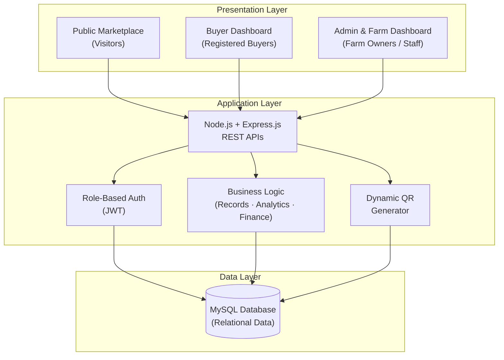
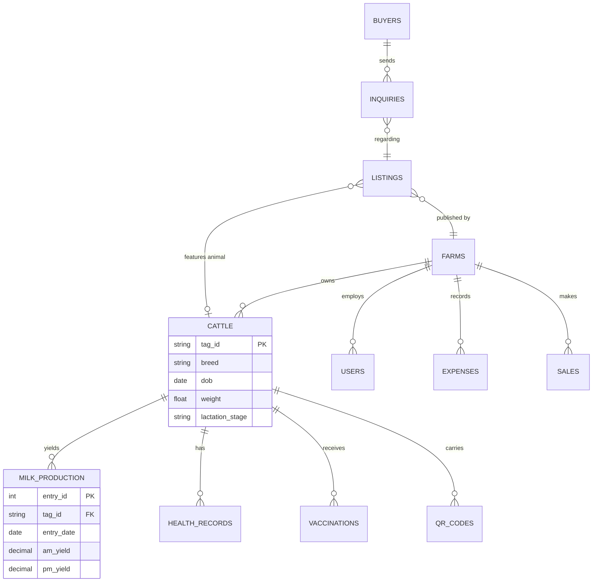

<div align="center">


# Oriva Dairy

### Smart Cattle & Farm Management System with Integrated Marketplace

**Every cow. Every litre. Every rupee - in one smart place.**

[](https://khdcoder.github.io/Oriva-Dairy/)
[](https://github.com/khdcoder/Oriva-Dairy/issues)
[](https://github.com/khdcoder/Oriva-Dairy/issues)

---


</div>

---

## Table of Contents

- [About the Project](#about-the-project)
- [Problem Statement](#problem-statement)
- [The Solution](#the-solution)
- [Current Status](#current-status)
- [Key Features](#key-features)
- [Landing Page Highlights](#landing-page-highlights)
- [Screenshots](#screenshots)
- [System Architecture](#system-architecture)
- [Technology Stack](#technology-stack)
- [Database Design (Planned)](#database-design-planned)
- [API Design (Planned)](#api-design-planned)
- [Design System](#design-system)
- [Project Structure](#project-structure)
- [Getting Started](#getting-started)
- [Deployment](#deployment)
- [Future Enhancements](#future-enhancements)
- [Contributing](#contributing)
- [License](#license)
- [Author](#author)
- [Acknowledgements](#acknowledgements)

---

## About the Project

**Oriva Dairy** is a web-based farm management system designed to digitize and simplify the daily operations of commercial livestock farms. It replaces traditional paper-based records with centralized digital management of **cattle, milk production, expenses, health records, and farm sales**.

The platform goes one step further by including an **integrated marketplace** that allows farm owners to sell livestock and dairy products directly to customers — reducing dependency on brokers and middlemen, and significantly improving profit margins.

Every animal registered on the platform receives a **unique Tag ID and a dynamic QR code** that acts as its digital passport, containing its complete, verifiable life record — from breed and lineage to vaccinations and daily milk yield.

> **Our mission:** Help dairy farmers run healthier herds, record every litre, and sell direct — with zero middlemen.

---

## Problem Statement

Livestock farming in South Asia still runs largely on paper. This creates a chain of problems that quietly eat away at a farm's profitability:

| Problem | Real-World Impact |
|---|---|
| **Manual record keeping** | Cattle, milk, medical and breeding records scattered across notebooks — often lost, always hard to analyze |
| **No health visibility** | A drop in a cow's milk yield is noticed weeks too late, costing the farmer real money |
| **Blind finances** | Feed, medicine and labour costs are never tallied against income — profit/loss is a guess |
| **Broker dependency** | Farmers sell through middlemen who take heavy cuts and block direct access to customers |
| **Zero buyer trust** | No verifiable health history means buyers hesitate, negotiate hard, or walk away |
| **No data for decisions** | Which cow to keep, which to sell, which feed is worth it — all decided by instinct, not numbers |

---

## The Solution

Oriva Dairy provides **one centralized platform with three doors** — each built for a different side of the trade:

### 1. Public Marketplace
- Browse available livestock and dairy products — no account needed
- View animal details: breed, age, weight, milk yield and health status
- Send purchase inquiries and bulk milk supply requests
- Scan any animal's QR code to open its verified live record

### 2. Buyer Dashboard
- Register and manage a personal buyer account
- Track livestock inquiries and order requests in one pipeline
- View verified health and vaccination records of reserved animals
- Access animal information anytime through dynamic QR codes

### 3. Admin & Farm Management Dashboard
- Manage the full herd with unique **Tag IDs + QR passports**
- Record daily (AM/PM) milk production per animal
- Maintain complete vaccination and medical histories
- Track farm expenses, income and sales with auto-categorization
- Manage livestock and dairy marketplace listings
- Generate financial reports and herd performance summaries

---

## Current Status

| Milestone | Status |
|---|:---:|
| Modern responsive landing page | **Done** |
| Mobile magic menu + full responsiveness | **Done** |
| Interactive feature explorer & mock dashboards | **Done** |
| Milk analytics SVG chart | **Done** |
| QR passport prototype (visual) | **Done** |
| Node.js + Express REST API | In Progress |
| MySQL database schema | Planned |
| Role-based authentication (JWT) | Planned |
| Buyer dashboard (functional) | Planned |
| Admin dashboard (functional) | Planned |
| Dynamic QR generation (server-side) | Planned |
| Payments & order flow | Planned |

---

## Key Features

### Cattle Management
- Complete digital profile for every animal — Tag ID, breed, age, weight, lineage, lactation stage and photo timeline
- Dynamic QR code per animal linking to its live record
- Herd registry with search, filter and status tracking

### Health Management
- Vaccination calendars (FMD, HS, deworming cycles)
- Treatment and medical history logs
- Buyer-verifiable health records via QR scan

### Milk Production Tracking
- AM/PM yield logging per animal or whole herd
- Daily totals, weekly trends and top-producer rankings
- Early dip detection before it becomes a loss

### Expense Management
- Feed, medicine, labour and equipment costs — auto-categorized
- Income and sale receipts recording
- Cost-per-litre calculation without spreadsheets

### Reports & Analytics
- One-tap profit & loss summaries
- Per-animal profitability ranking
- Herd performance overviews

### Integrated Marketplace
- Livestock and dairy listings backed by verified farm records
- Direct buyer inquiries — no commissions
- Bulk milk supply offers for cafes, hotels and processors

---

## Landing Page Highlights

The current release ships with a fully-crafted product landing page:

- Full-screen hero with staggered headline animation and a floating **live cattle-passport card**
- Auto-scrolling breed & feature marquee
- Scroll-triggered **count-up statistics**
- Interactive **feature explorer** (auto-rotating, click-to-switch; accordion on mobile)
- Hand-drawn **SVG milk analytics chart** with hover tooltips and week toggling
- **Traceability section** with a JS-generated QR passport card
- Role tabs with **browser-frame dashboard mockups** (Marketplace / Buyer / Admin)
- Horizontal **marketplace carousel** with inquiry modal + toast notifications
- Rotating farmer testimonials, FAQ accordion and a validated contact form
- Lengthy footer with newsletter subscription and watermark branding
- Full mobile "magic menu" with staggered link reveal

---

## Screenshots

> Add screenshots to a `docs/screenshots/` folder, then update the paths below.

| Hero Section | Feature Explorer |
|---|---|
|  |  |

| Milk Analytics | Marketplace |
|---|---|
|  |  |

| Mobile Menu | Footer |
|---|---|
|  |  |

---

## System Architecture

The system follows a classic **3-Tier Web Architecture**:



**Flow:** The responsive frontend consumes REST APIs → the application layer handles authentication, validation, QR generation and business logic → the MySQL data layer stores all relational records (animals, yields, health, finance, marketplace).

---

## Technology Stack

| Component | Technology |
|---|---|
| Frontend | HTML5, CSS3, JavaScript (ES6+) |
| UI Framework | Vanilla CSS (custom design system) — Tailwind/Bootstrap optional |
| Fonts | Fraunces (display serif) + Outfit (UI sans) |
| Icons | Lucide Icons |
| Charts | Custom SVG (vanilla JS) |
| Backend | Node.js, Express.js |
| Database | MySQL |
| API Architecture | RESTful APIs |
| Authentication | Role-Based Access Control (RBAC) + JWT |
| QR System | Dynamic QR Code Generation (server-side) |
| Hosting (frontend) | GitHub Pages |
| Hosting (planned) | Render / Railway / VPS |

---

## Database Design (Planned)

Core relational entities:



---

## API Design (Planned)

| Method | Endpoint | Description |
|---|---|---|
| `POST` | `/api/auth/register` | Register buyer/farm account |
| `POST` | `/api/auth/login` | Login, returns JWT |
| `GET` | `/api/cattle` | List herd (admin) |
| `POST` | `/api/cattle` | Register new animal + Tag ID |
| `GET` | `/api/cattle/:tagId` | Animal full profile |
| `GET` | `/api/cattle/:tagId/qr` | Get dynamic QR payload |
| `POST` | `/api/cattle/:tagId/health` | Add vaccination/treatment record |
| `POST` | `/api/milk/entries` | Log AM/PM yield |
| `GET` | `/api/milk/summary` | Daily/weekly analytics |
| `POST` | `/api/expenses` | Record expense (auto-categorized) |
| `GET` | `/api/reports/pnl` | Profit & loss summary |
| `GET` | `/api/listings` | Public marketplace listings |
| `POST` | `/api/listings` | Create listing (admin) |
| `POST` | `/api/inquiries` | Buyer sends inquiry |
| `GET` | `/api/inquiries` | Track inquiries (role-based) |

---

## Design System

| Token | Value | Usage |
|---|---|---|
| `--cream` | `#F7F3E9` | Page background |
| `--green` | `#1E5B40` | Primary brand color |
| `--green-deep` | `#0F3325` | Dark sections |
| `--green-black` | `#0A231A` | Footer |
| `--amber` | `#E3A63C` | Accent / CTA |
| `--ink` | `#16241B` | Body text |
| Display font | Fraunces | Headings, numbers |
| UI font | Outfit | Body, labels, buttons |

---

## Project Structure

```
Oriva-Dairy/
│
├── index.html                  # Landing page (current release)
├── README.md
├── LICENSE
│
├── docs/
│   ├── banner.png              # README banner
│   └── screenshots/            # Landing page screenshots
│
└── (planned structure)
    ├── client/                 # Frontend application
    │   ├── index.html
    │   ├── styles/
    │   └── scripts/
    │
    ├── server/                 # Node.js + Express API
    │   ├── package.json
    │   └── src/
    │       ├── index.js        # Entry point
    │       ├── config/         # DB & env config
    │       ├── routes/         # REST route definitions
    │       ├── controllers/    # Request handlers
    │       ├── models/         # MySQL data access
    │       ├── middleware/     # Auth (JWT), RBAC, validation
    │       └── utils/          # QR generator, helpers
    │
    └── database/
        └── schema.sql          # Tables + seed data
```

---

## Getting Started

### Prerequisites

- Any modern browser (Chrome, Edge, Firefox, Safari)
- *(for backend, later)* Node.js ≥ 18, MySQL ≥ 8

### Run the Landing Page Locally

```bash
# 1. Clone the repository
git clone https://github.com/khdcoder/Oriva-Dairy.git

# 2. Move into the project folder
cd Oriva-Dairy

# 3. Simply open index.html in your browser
#    — or serve it properly:
npx serve .
```

Open [http://localhost:3000](http://localhost:3000) (or the port `serve` prints).

> **Tip:** Replace the placeholder `picsum.photos` image links inside `index.html` with your real farm photography (search "picsum" to find them all).

---

## Future Enhancements

The roadmap is organized into phases — from completing the core platform to building an intelligent dairy ecosystem.

### Phase 1 — Core Platform Completion
- [ ] Full Node.js + Express REST API implementation
- [ ] MySQL schema with migrations and seed data
- [ ] JWT authentication with refresh tokens
- [ ] Role-based access control (Admin, Farm Worker, Vet, Buyer)
- [ ] Functional buyer dashboard (inquiry tracking)
- [ ] Functional admin dashboard (herd, milk, expenses, listings)
- [ ] Server-side dynamic QR generation with printable tag layouts
- [ ] Bulk paper-record digitization import tool

### Phase 2 — User Experience & Reach
- [ ] **Progressive Web App (PWA)** — installable, with offline milk logging that syncs when back online
- [ ] **Multilingual UI** — English, Urdu and Roman Urdu
- [ ] **SMS & WhatsApp notifications** — vaccination reminders, heat-cycle alerts, new buyer inquiries
- [ ] **Report exports** — PDF and Excel for P&L, health records and milk summaries
- [ ] Dark mode
- [ ] Accessibility audit (WCAG 2.1 AA)

### Phase 3 — Commerce & Ecosystem
- [ ] **Payment gateway integration** — JazzCash, EasyPaisa, bank transfer and card payments
- [ ] Escrow-style secure transactions between farm and buyer
- [ ] **Live auctions & bidding** for high-value livestock
- [ ] Veterinarian directory with tele-consultation booking
- [ ] Feed, medicine and farm-supplies marketplace
- [ ] Transport & logistics booking for animal delivery
- [ ] Buyer ratings and verified farm reviews
- [ ] Location-based farm discovery (map integration)

### Phase 4 — Intelligence & Automation (Long-Term Vision)
- [ ] **IoT integration** — RFID smart ear tags, digital milk meters and automatic weighing scales feeding data into the platform with zero manual entry
- [ ] **Real-time dashboards** via WebSockets (live yield, live inquiries)
- [ ] **AI / Machine Learning:**
  - Milk yield forecasting per cow and per herd
  - Disease early-warning from yield dips and behavior patterns
  - Optimal breeding-window (heat) prediction
  - Feed plan cost optimization
- [ ] **Voice-based data entry** in local languages for low-literacy farmers
- [ ] **Native mobile apps** (React Native or Flutter)
- [ ] **Blockchain-backed traceability** for export-grade buyer trust
- [ ] Market price index for livestock and milk rates
- [ ] Multi-farm / cooperative management mode
- [ ] Integration with government dairy schemes and livestock insurance
- [ ] Sustainability metrics — carbon and water footprint per litre of milk

---

## Contributing

Contributions are what make the open-source community such an amazing place to learn, inspire and create. Any contributions you make are **greatly appreciated**.

1. Fork the project
2. Create your feature branch (`git checkout -b feature/AmazingFeature`)
3. Commit your changes (`git commit -m 'Add some AmazingFeature'`)
4. Push to the branch (`git push origin feature/AmazingFeature`)
5. Open a Pull Request

Please make sure to follow the existing code style and keep commits clean and descriptive.

---

## License

Distributed under the **MIT License**. See `LICENSE` for more information.

---

## Author

**khdcoder**

[](https://github.com/khdcoder)
[](mailto:youremail@example.com)


---

## Acknowledgements

- [Fraunces](https://fonts.google.com/specimen/Fraunces) & [Outfit](https://fonts.google.com/specimen/Outfit) — typography
- [Lucide Icons](https://lucide.dev/) — icon set
- [Shields.io](https://shields.io/) — README badges
- [Mermaid](https://mermaid.js.org/) — architecture diagrams
- Every dairy farmer still keeping records in a notebook — this project is for you

---

## Star History

[](https://star-history.com/#khdcoder/Oriva-Dairy&Date)

---

<div align="center">
  <strong>Oriva Dairy</strong> — Grown with care for our farmers.
</div>
```
